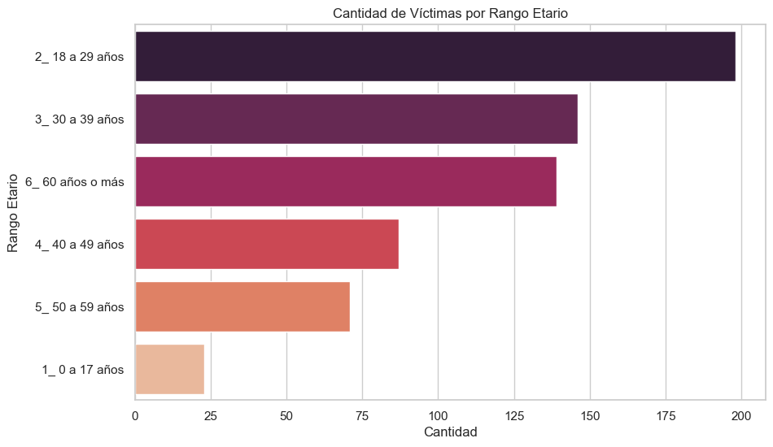
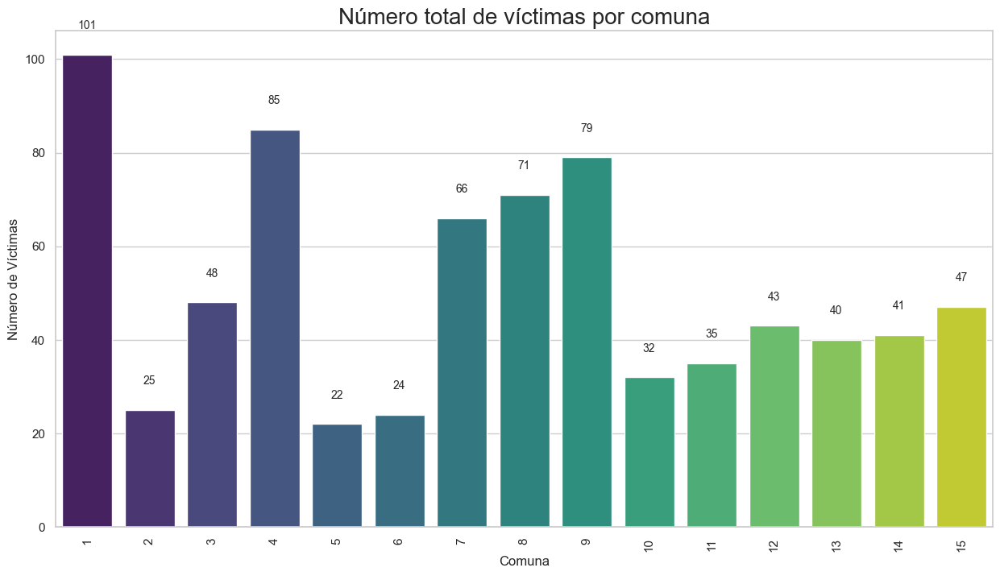
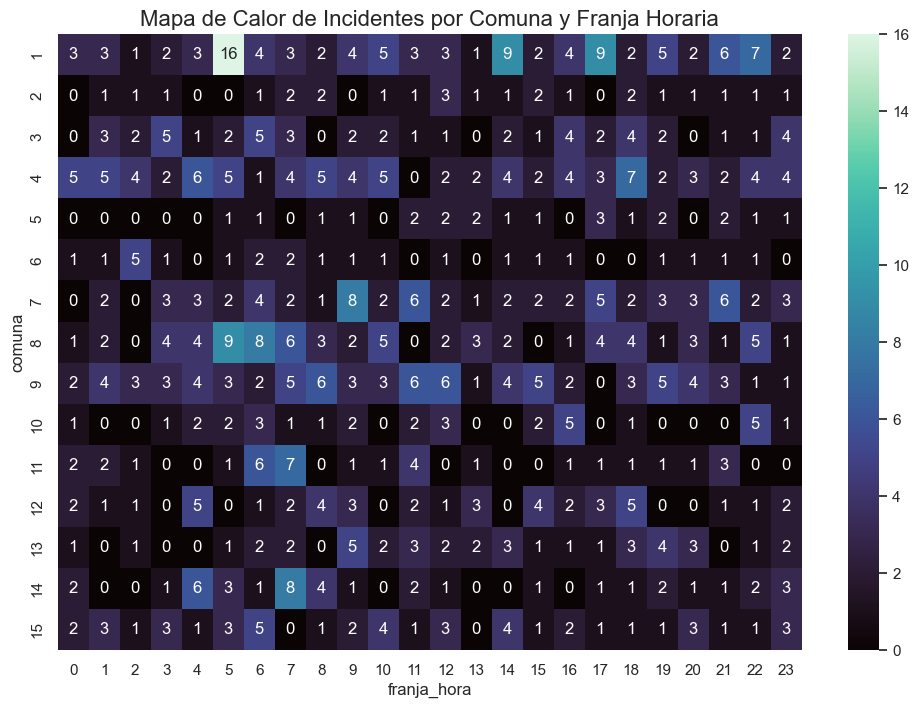
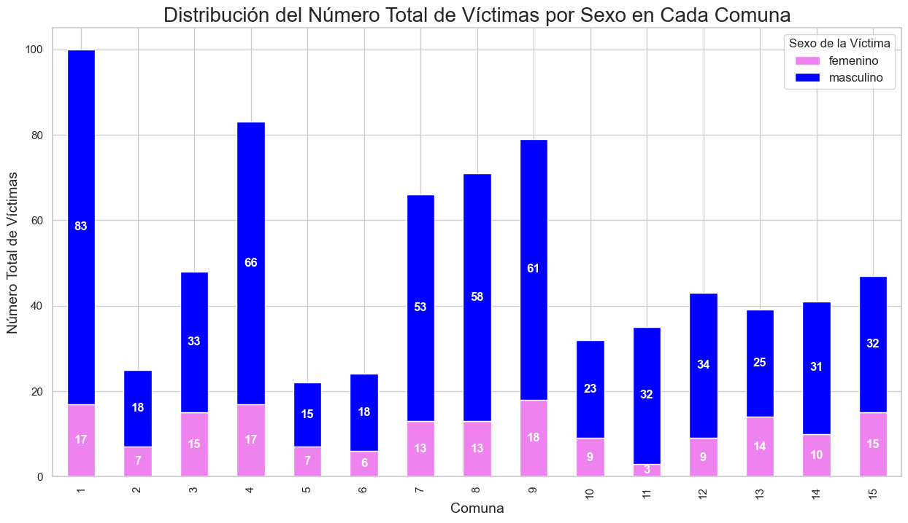
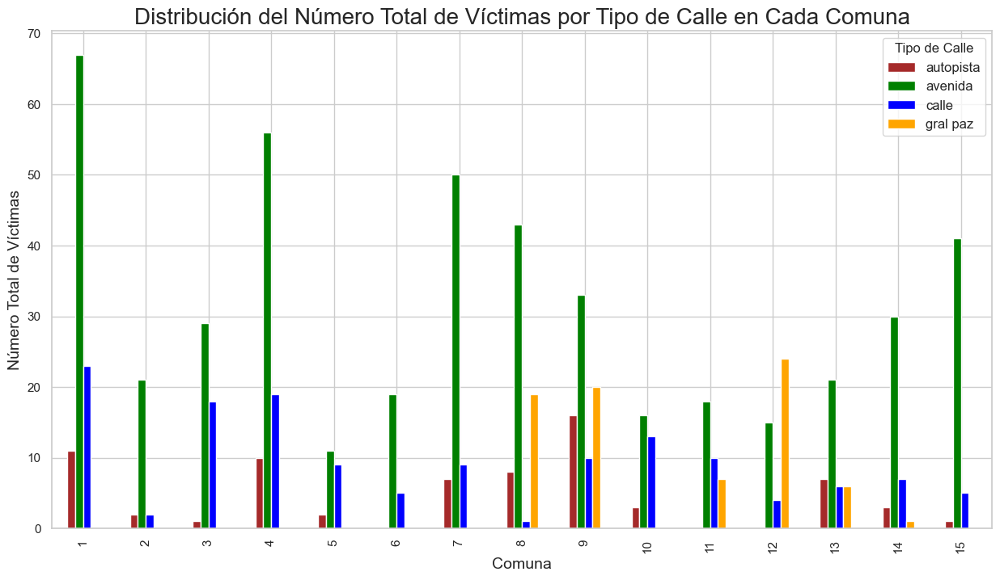
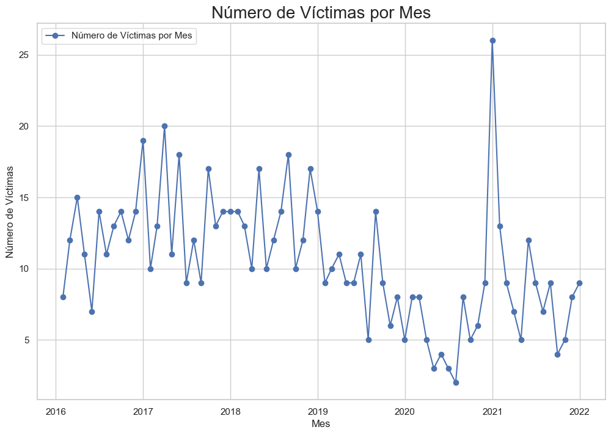
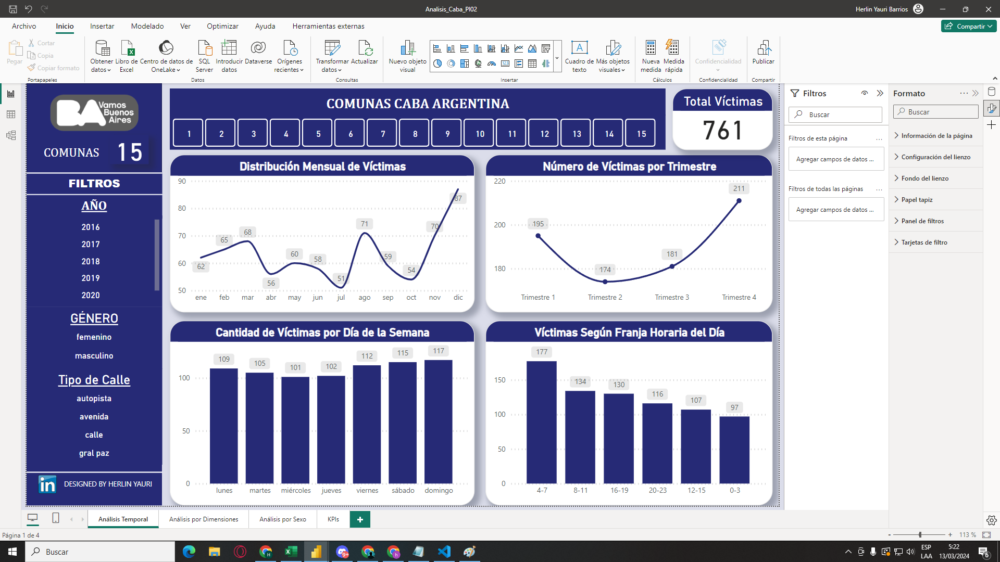
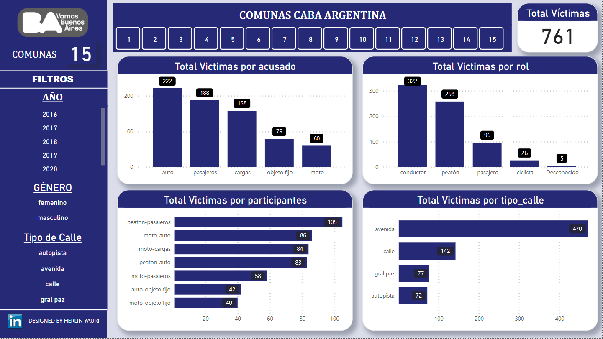
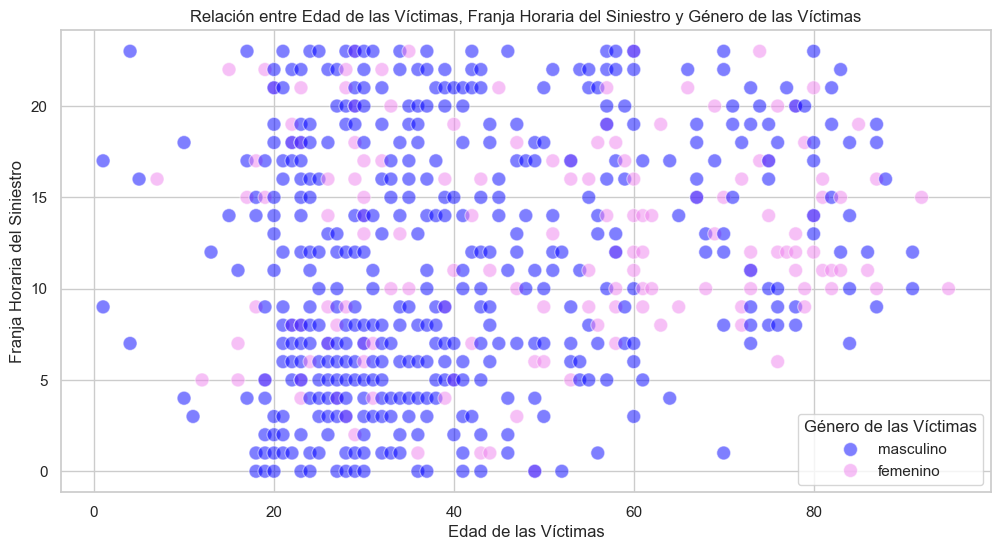
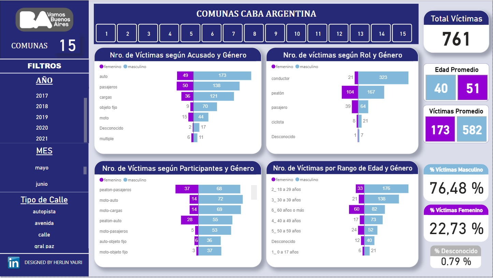

## **Proyecto Individual** - 02-Siniestros Viales en CABA con víctimas fatales -(2016-2021) 

## **Introducción** 🚦 🚨

Este proyecto fue llevado a cabo con el rol simulado de un Analista de Datos en una consultora, con el propósito de realizar un análisis de datos solicitado por el Observatorio de Movilidad y Seguridad Vial (OMSV), perteneciente a la Secretaría de Transporte del Gobierno de la Ciudad Autónoma de Buenos Aires (CABA).

El objetivo principal del proyecto es proporcionar información fundamentada que pueda guiar la toma de decisiones pertinentes para la prevención y la mejora de la seguridad vial, así como la reducción de los accidentes de tránsito con víctimas fatales en la Ciudad de Buenos Aires.

Las tasas de mortalidad asociadas a los accidentes de tránsito suelen ser un indicador crítico de la seguridad vial en una determinada región. Estas tasas se calculan habitualmente como el número de fallecimientos por cada cierto número de habitantes o por cada cierta cantidad de vehículos registrados. La reducción de estas tasas es esencial para mejorar la seguridad vial y preservar la vida de los ciudadanos en la urbe.

Para cumplir con este objetivo, se utilizan datos iniciales derivados de un conjunto de datos que contiene información sobre homicidios relacionados con siniestros viales en la Ciudad de Buenos Aires, abarcando los años 2016-2021. Estos datos son de acceso público y pueden encontrarse en la página oficial de la CABA. 

Puedes acceder a ellos a través del siguiente enlace: [Datos oficiales](https://data.buenosaires.gob.ar/dataset/victimas-siniestros-viales)

## **Contexto** 🔍

Los incidentes viales, también conocidos como accidentes de tráfico o colisiones en la vía pública, son sucesos que involucran vehículos y pueden ser causados por una variedad de factores, como colisiones entre automóviles, motocicletas, bicicletas o peatones, atropellos, impactos con objetos fijos o vuelcos de vehículos. Estos eventos pueden acarrear consecuencias que van desde daños materiales hasta lesiones graves o incluso fatales para los involucrados.

En Argentina, se reportan alrededor de 4.000 muertes anuales a causa de siniestros viales, manteniéndose como una de las principales causas de fallecimiento violento en el país a pesar de los esfuerzos por reducir los accidentes de tráfico. Según los datos del Sistema Nacional de Información Criminal (SNIC) del Ministerio de Seguridad de la Nación, entre los años 2018 y 2022 se registraron un total de 19.630 muertes por accidentes de tránsito en todo el país, lo que representa un promedio de 11 víctimas fatales por día.

Buenos Aires, la capital y ciudad más poblada de la República Argentina, tiene una superficie de aproximadamente 200 km² y su perímetro abarca unos 60 km. La población de la ciudad está distribuida en quince comunas y tiene una densidad poblacional de más de 15.000 habitantes por kilómetro cuadrado. Las zonas centro y norte son las áreas con mayor densidad de población. Según el último censo de 2022, la población de la ciudad es de 3.120.612 habitantes.

Solo en el año 2022, se registraron un total de 3.828 muertes fatales en siniestros viales en Buenos Aires. Los expertos en la materia señalan que en Argentina es dos o tres veces más probable que una persona fallezca en un accidente de tránsito que en un incidente delictivo de otro tipo. Por todas estas razones, el estudio del problema y la implementación de medidas para prevenir y reducir los siniestros viales son de suma importancia para las autoridades correspondientes.

## **Desarrollo** 🚦 🚨

### Datos 📑

Este proyecto se basó en la utilización de la **Bases de Víctimas Fatales en Siniestros Viales**, la cual está disponible en formato de Excel y está compuesta por varias hojas de datos distintas, entre tablas y diccionarios:

 * **HECHOS**: que contiene una fila de hecho con id único y las variables temporales, espaciales y participantes asociadas al mismo.

 * **VICTIMAS**: contiene una fila por cada víctima de los hechos y las variables edad, sexo y modo de desplazamiento asociadas a cada víctima. Se vincula a los HECHOS mediante el id del hecho.
En este mismo documento Excel, se encuentran los diccionarios pertinentes para cada tabla, servirán para poder entender mejor la data a trabajar. Por otra parte, en este [link](https://data.buenosaires.gob.ar/dataset/victimas-siniestros-viales) se encuentran los datos utilizados en el análisis.

# Documentación ETL 🚦 🚨

## Objetivo del Proyecto

El objetivo principal de este proyecto es analizar los siniestros viales ocurridos en la Ciudad Autónoma de Buenos Aires (CABA) entre los años 2016 y 2021, con especial enfoque en los incidentes que resultaron en homicidios y lesiones. A través de un minucioso proceso de Extracción, Transformación y Carga (ETL), preparamos los datos para su posterior análisis y visualización en Power BI, buscando identificar patrones y ofrecer insights que contribuyan a la creación de políticas públicas enfocadas en la mejora de la seguridad vial.

### Extracción de los Datos

Los conjuntos de datos se extrajeron de archivos en formato `.xlsx`, suministrados por el Observatorio de Movilidad y Seguridad Vial (OMSV). Estos archivos contienen información valiosa sobre los incidentes de tráfico que han resultado en lesiones y fatalidades, divididos en distintas hojas para hechos y víctimas, respectivamente.

### Transformación Profunda de los Datos

#### Limpieza y Preparación

- **Eliminación de Columnas Irrelevantes**: Se procedió a descartar aquellas columnas que, tras un análisis detenido, se determinaron como no contribuyentes a los objetivos analíticos del proyecto.

- **Manejo Exhaustivo de Valores Nulos**: Cada campo fue evaluado individualmente, optando por técnicas específicas de imputación o eliminación para mantener la calidad y la integridad de los datos para el análisis.

- **Conversión y Normalización de Tipos de Datos**: Se convirtieron las fechas a formato `datetime` y se normalizaron otros tipos de datos para garantizar la uniformidad y precisión en el análisis.

- **Renombramiento y Estandarización de Columnas**: Se estandarizaron los nombres de las columnas para asegurar claridad y consistencia en todo el conjunto de datos, facilitando la interpretación y el análisis posterior.

#### Integración y Unificación

- **Consolidación de DataFrames**: Realizamos una unión cuidadosa de los DataFrames `homicidios_hechos_victimas` y `lesiones_hechos_victimas`, utilizando claves únicas y manteniendo solo la información pertinente para construir un conjunto de datos completo y representativo de todos los siniestros viales reportados.

- **Ajuste y Verificación de Coordenadas Geográficas**: Corregimos y validamos las coordenadas geográficas para permitir análisis espaciales precisos y la creación de mapas detallados en las fases de visualización.

### Carga y Preparación para Análisis

Los datos transformados y enriquecidos se cargaron en Power BI, donde se diseñaron modelos de datos optimizados para análisis. Esto incluyó la creación de relaciones entre las distintas tablas de datos, la definición de medidas calculadas y la preparación de dashboards interactivos. Nuestro enfoque permitió explorar en profundidad los patrones de siniestros viales, identificando tendencias clave, puntos críticos y otros insights valiosos que pueden informar el desarrollo de políticas de seguridad vial más efectivas en CABA.

## Conclusiones y Futuras Direcciones

El detallado proceso ETL documentado aquí sienta una base sólida para un análisis exhaustivo de los siniestros viales en CABA, con el potencial de impactar significativamente en la formulación de estrategias de prevención y mejora de la seguridad vial. Futuras investigaciones pueden expandirse sobre este trabajo, explorando relaciones más profundas y aplicando modelos predictivos para anticipar y mitigar los riesgos de siniestros viales.

El proceso detallado de ETL se puede verificarar en el siguiente notebook: [Proceso de ETL(Extracción, Transformación y Carga)](notebooks/1-ETL.ipynb).

# Documentación EDA 🚦 🚨

## Análisis `Homicidios` por **Edad**

  

### **Conclusión**
- El diagrama de barras muestra la distribución de las víctimas según diferentes **``rangos etarios``**. Se observa que el **``rangos etarios``** con la mayor cantidad de víctimas se encuentra en la categoría de **"18 a 29 años"**, seguido por el rango etario **"30 a 39 años"**, luego le siguen otros grupos de edad. Esta información sugiere que la población más joven tiene una representación significativa en los incidentes viales registrados, lo que puede indicar áreas de enfoque para medidas de prevención y seguridad vial dirigidas a este grupo demográfico.

## Análisis `Homicidios` por **Comuna**

  

## **Conclusión**
- En el gráfico "Número total de víctimas por comuna", se observa una variación marcada en la cantidad de víctimas de accidentes de tránsito entre las distintas comunas. Por ejemplo, la **``Comuna 1``** presenta el mayor número de víctimas, con un total de **101** casos, mientras que la **``Comuna 5``** y la **``Comuna 10``** registran **22** y **32** víctimas, respectivamente. Esta discrepancia sugiere que la **``Comuna 1``** podría beneficiarse de intervenciones específicas para mejorar la seguridad vial y reducir el número de accidentes, como campañas de concientización, mejoras en la señalización o medidas de control de velocidad.

## Mapa de calor de Incidentes por ``Comuna`` y ``Franja Horaria``

  

### **Conclusiones**
- Patrones Horarios: Observamos que hay franjas horarias específicas con una mayor concentración de incidentes en varias comunas. Por ejemplo, en la Franja Horaria 5, la Comuna 1 muestra un aumento significativo en incidentes en comparación con otras franjas horarias y comunas.

- Comunas con Mayor Incidencia: Algunas comunas, como la Comuna 4, Comuna 8 y Comuno 9, presentan una alta concentración de incidentes a lo largo del día en varias franjas horarias, lo que podría indicar áreas con desafíos particulares en términos de seguridad vial.

- Franjas Horarias Críticas: Se pueden identificar franjas horarias críticas con una alta incidencia de incidentes en múltiples comunas. Por ejemplo, las Franjas Horarias 5, 6 y 7 muestran números notables de incidentes en varias comunas.

## Distribución del número ``Total`` de ``Víctimas por Sexo en Cada Comuna``

  

### **Conclusiones**
- Desigualdad de género en las víctimas: Hay una notable diferencia entre el número de víctimas masculinas y femeninas en todas las comunas, con un predominio significativo de víctimas masculinas. Esto podría indicar una tendencia de mayor exposición o riesgo en hombres en comparación con mujeres en lo que respecta a accidentes de tránsito o siniestros viales.

- Comunas con mayor número de víctimas: La Comuna 1 presenta el número más alto de víctimas totales, seguida de las Comunas 9 y 8. Estos datos podrían sugerir que estas comunas tienen puntos de alta peligrosidad o mayor tráfico, lo que incrementa el riesgo de incidentes.

- Consistencia en la distribución: La consistencia en la distribución del número de víctimas por sexo en las comunas sugiere que el riesgo de ser víctima no depende de la localización geográfica dentro de la ciudad, sino más bien de factores relacionados con el género.

## Distribución del número ``Total de Víctimas`` por ``tipo_calle`` en cada ``Comuna``

  

## **Conclusiones**
- Tipos de calles con mayor incidencia: Las avenidas parecen ser el tipo de calle con mayor número de víctimas en la mayoría de las comunas, lo cual podría deberse a un mayor flujo vehicular y a la alta velocidad permitida en comparación con calles comunes.

- Variaciones por comuna: Existe una variación significativa en el número de víctimas entre las diferentes comunas. Por ejemplo, la Comuna 8 tiene un alto número de víctimas en avenidas, mientras que la Comuna 9 muestra una distribución más uniforme entre avenidas y calles comunes.

- Comunas con riesgo elevado en Autopistas: Algunas comunas, como la 1 y 9, muestran un número elevado de víctimas en autopistas, lo que sugiere puntos de alto riesgo o una necesidad de mejorar las medidas de seguridad vial en dichos tramos.

# Análisis ``Homicidios`` en el tiempo 🚦 🚨

## Evolución ``Anual`` del número de ``Víctimas`` en incidentes de tráfico

  

### **Conclusiones**
- Tendencia general: Hubo un descenso notable en el número de víctimas desde 2018 hasta 2020, seguido de un ligero aumento en 2021. Esta tendencia podría deberse a diversas razones, como cambios en la infraestructura vial, políticas de tráfico o incluso eventos externos como la pandemia de COVID-19.

- Impacto de eventos específicos: La marcada disminución de víctimas en 2020 podría estar relacionada con las restricciones de movilidad impuestas por la pandemia de COVID-19, lo que habría resultado en menos vehículos en las calles y, por ende, menos accidentes.

- Evaluación de políticas públicas: Si las medidas de seguridad vial se fortalecieron o se implementaron nuevas políticas entre 2018 y 2020, el gráfico podría sugerir que estas fueron efectivas en la reducción del número de víctimas. Sería importante analizar la correlación entre las intervenciones realizadas y la disminución observada.

- Necesidad de mantener esfuerzos: El aumento en el número de víctimas en 2021 indica que es importante mantener y posiblemente fortalecer las iniciativas de seguridad vial para evitar un repunte en los accidentes.

## Análisis ``Temporal`` de Incidentes de Tráfico

  

### **Conclusiones**
- Víctimas por año:
Se observa una disminución general en el número de víctimas desde 2018, con un ligero aumento en 2021.
Esta tendencia refleja posiblemente el impacto de políticas de tránsito y eventos globales, como la pandemia, que han afectado el número de incidentes.

- Víctimas por mes:
Hay una variación en el número de víctimas a lo largo del año, con picos que podrían correlacionarse con factores estacionales, eventos específicos o variaciones en el flujo vehicular.

- Víctimas por día de la semana:
Los fines de semana (sábado y domingo) presentan un número mayor de víctimas, lo que puede estar asociado a un incremento en las actividades recreativas y la movilidad nocturna.

- Víctimas por franja horaria:
Las horas con mayor cantidad de víctimas coinciden con los momentos de mayor actividad en la ciudad, como son las horas pico de la mañana (5, 6 y 7 AM) y las de la tarde (de 15 a 18 horas). Esto podría sugerir una correlación entre el aumento del tráfico y la incidencia de accidentes. Necesario optar por medidas de mitigación que puedan ser implementadas en estos horarios específicos para reducir la cantidad de víctimas. Además, al observar la concentración de incidentes durante las horas pico, las autoridades podrían considerar refuerzos en la seguridad vial o campañas de concienciación en esos horarios críticos.

## Análisis por variables restantes 🚦 🚨
## Gráficos de ``Distribución`` para ``Roles``, ``Acusados``, ``Vehículos de Víctimas`` y ``Tipos de Calle``

  
  

### **Conclusiones**
- Los conductores son el grupo más frecuentemente implicado en accidentes, seguido por los peatones, lo que resalta la importancia de medidas de seguridad tanto para los que manejan como para los que caminan por la ciudad.

- En cuanto a los acusados, los vehículos tipo auto y pasajeros lideran la lista, sugiriendo que los accidentes comúnmente involucran a automóviles privados y al transporte público.

- La mayoría de las víctimas están asociadas a motos y peatones, lo que puede indicar una vulnerabilidad mayor de estos grupos en el tráfico urbano.

- Las avenidas son, con diferencia, el tipo de calle con más accidentes registrados, seguido de calles y luego de la gral paz y autopistas, lo cual podría reflejar una mayor complejidad o un volumen más alto de tráfico en estos tipos de vías.

## Análisis por `sexo` de la **víctima** 🚦 🚨

### Relación entre ``Edad`` de las ``Víctimas``, ``Franja Horaria`` del ``Siniestro`` y ``Género`` de las Víctimas

  
  

### **Conclusiones**
- Predominancia de víctimas masculinas: Se observa una mayor cantidad de puntos azules en comparación con los violetas, lo que indica que los hombres son más a menudo víctimas de siniestros en todas las franjas horarias y grupos de edad.

- Concentración de siniestros en jóvenes adultos: Hay una alta densidad de puntos, especialmente azules, en el rango de edad de 20 a 40 años, lo que sugiere que los jóvenes adultos están más involucrados en siniestros. Además, se nota una disminución progresiva en la cantidad de víctimas a medida que aumenta la edad.

- Horarios de mayor riesgo: Los puntos están distribuidos de manera más densa durante las primeras horas de la mañana (alrededor de las 5-8 am) y luego desde el medio día hasta la tarde (aproximadamente de 3-6 pm). Esto podría indicar patrones de mayor riesgo asociados con horarios de tráfico intenso, como las horas pico durante la jornada laboral.

## Distribución del Número ``Total de Víctimas`` según el ``Género``

  
  

### **Conclusiones**
- Desproporción en la incidencia por género: Los hombres están involucrados en un número significativamente mayor de accidentes en comparación con las mujeres, lo que sugiere que podrían beneficiarse más de campañas de prevención y educación vial.

- Riesgos por tipo de participante: Los conductores y peatones constituyen las categorías más afectadas, lo cual enfatiza la necesidad de estrategias de seguridad diferenciadas que aborden tanto la conducción segura como el tránsito peatonal protegido.

- Distribución de accidentes por tipo de calle: Las avenidas son el escenario más común de accidentes, lo que puede estar relacionado con la velocidad más alta permitida y el volumen de tráfico. Estrategias como la mejora de señalización y la implementación de cámaras de velocidad podrían ser medidas efectivas en estas zonas.

- Víctimas de accidentes por rol de la víctima: El alto número de peatones involucrados en accidentes resalta la importancia de mejorar las infraestructuras peatonales, como cruces seguros y mayor visibilidad en zonas de alto tráfico.

Para obtener más detalles sobre el proceso EDA se puede consultar la sección correspondiente en el [Notebook EDA, Tratamiento de Datos y Preparación](2-EDA.ipynb)

### Indicadores de Rendimiento Clave KPI⛔

Una vez finalizado el Análisis Exploratorio, se utiliza el dataset resultante [Siniestros](data/siniestos_limpio.csv) y los extraidos de la página oficial de CABA con los datos de las comunas [Comunas](data/comunas.xlsx); para trabajar en la herramienta PowerBi a fin de obtener los KPI (Indicadores de Rendimiento Clave) y un `dashboard` de presentación del informe y Visualización de datos.
Se utliza la herramienta NovyPro para mostrar el `dashboard` resultante de manera interactiva. [link](https://www.novypro.com/project/proyecto-individual-02--siniestros-viales-caba--dataanalytics)

KPI Propuestos

  
  

# Conclusiones de KPIs - Análisis de Siniestros Viales en CABA 📊🔍🚗

## KPI: Reducción del 10% en la Tasa de Homicidios en los Últimos Seis Meses

Durante el segundo semestre de 2021, la tasa de homicidios en siniestros viales mostró una disminución significativa en comparación con el primer semestre del mismo año. La tasa decreció de 1,79 a 1,36 homicidios por cada 100,000 habitantes, lo que indica un descenso del 23,64%, superando ampliamente la meta del 10%. Este resultado sugiere que las iniciativas de seguridad vial implementadas han sido efectivas y deben mantenerse o incluso intensificarse para seguir esta tendencia positiva.

## KPI: Reducción del 7% en Accidentes Mortales de Motociclistas en el Último Año

Contrario a la meta propuesta, el análisis revela un aumento en la cantidad de accidentes mortales de motociclistas de 32 en 2020 a 46 en 2021. Este incremento destaca una preocupante tendencia que contraviene los esfuerzos por mejorar la seguridad vial para los motociclistas en CABA. Este hallazgo señala la urgente necesidad de revisar y reforzar las políticas de tránsito actuales, así como implementar medidas adicionales que puedan mitigar los riesgos a los que se enfrentan los conductores de motocicletas.

## KPI: Reducir un 15% la Tasa de Homicidios Masculinos

El logro de una disminución del 33,33% en la tasa de homicidios de individuos del sexo masculino en siniestros viales muestra un avance significativo hacia la mejora de la seguridad de esta demografía. Estos resultados enfatizan la importancia de estrategias de intervención específicas, como la focalización en comportamientos de riesgo comunes y la promoción del uso de equipamiento de seguridad.

## Reflexiones Finales

Los KPIs evaluados demuestran avances importantes en varias áreas de la seguridad vial en CABA, aunque también subrayan la necesidad de continuar con políticas de prevención y educación vial. La superación de las metas establecidas refleja un compromiso sólido con la seguridad vial y establece un precedente positivo para futuras iniciativas.

---

Los datos y conclusiones presentados refuerzan la necesidad de una vigilancia y evaluación constante de los programas de seguridad vial, así como la adaptación de estrategias para abordar las áreas donde no se cumplen los objetivos.

## **Conclusiones Finales**💻 📑

- El análisis detallado de los datos de siniestros viales entre 2016 y 2021 revela que un total de 717 personas han perdido la vida debido a accidentes de tráfico. Las franjas horarias más críticas corresponden a los momentos de mayor flujo vehicular, específicamente durante las horas de inicio y fin de la jornada laboral (de 5 a 8 h y de 15 a 18 h, respectivamente), y en las primeras horas de la mañana durante los fines de semana (de 3 a 7 h), coincidiendo con el cierre de actividades nocturnas.

- El perfil predominante de las víctimas es masculino, representando el 76.48% del total, con una concentración de edad entre los 20 y 40 años. En estos casos, la mayoría de las víctimas masculinas ocupaban el rol de conductores en el momento del incidente. En cuanto a los vehículos involucrados, las motocicletas y los peatones son los más afectados, mientras que autos, colectivos y vehículos de carga aparecen con mayor frecuencia como los vehículos de los acusados.

- Es evidente que las avenidas son los escenarios más comunes para estos trágicos eventos, con una incidencia particularmente alta en los cruces de calles. Se detectó un patrón claro que vincula la edad, el horario y el género, especialmente entre hombres jóvenes en horas pico y durante periodos de actividad social intensa en fines de semana.

- Para abordar esta problemática, se recomienda fortalecer la señalización y la implementación de controles de tráfico en las avenidas, particularmente en las comunas 1 y 4 de la Ciudad Autónoma de Buenos Aires. Adicionalmente, se sugiere la creación de campañas de concienciación dirigidas a hombres jóvenes, con el fin de promover prácticas de conducción seguras y responsables. Estas acciones podrían tener un impacto significativo en la reducción de la frecuencia y severidad de los siniestros viales en la ciudad.

# Tecnologías Utilizadas en el Proyecto 

El desarrollo de este proyecto de análisis de datos sobre siniestros viales ha integrado diversas herramientas tecnológicas que han permitido una gestión eficiente y una visualización efectiva de la información. A continuación, se detallan las tecnologías empleadas:

## Python
Python ha sido fundamental para el procesamiento de datos, aprovechando sus robustas bibliotecas para análisis de datos como Pandas y NumPy. La limpieza, transformación y análisis exploratorio se realizaron utilizando este lenguaje de programación de alto nivel.

  
  

## Power BI
Power BI permitió la creación de dashboards interactivos y visualizaciones atractivas que facilitan la interpretación de los datos. Su uso intensivo en el proyecto posibilitó la representación gráfica de los KPIs y las tendencias importantes de los siniestros viales.

  
  

## Visual Studio Code
Visual Studio Code fue el editor de código seleccionado para escribir y editar scripts de Python y consultas SQL. Su interfaz intuitiva y su soporte para una amplia gama de extensiones y lenguajes de programación lo hacen ideal para proyectos de análisis de datos.

  
  

**Cada una de estas herramientas ha aportado sus propias fortalezas al proyecto, contribuyendo a un análisis de datos integral y a una toma de decisiones**

## Autor

- [Herlin Yauri Barrios](https://github.com/HerlinData)

  

